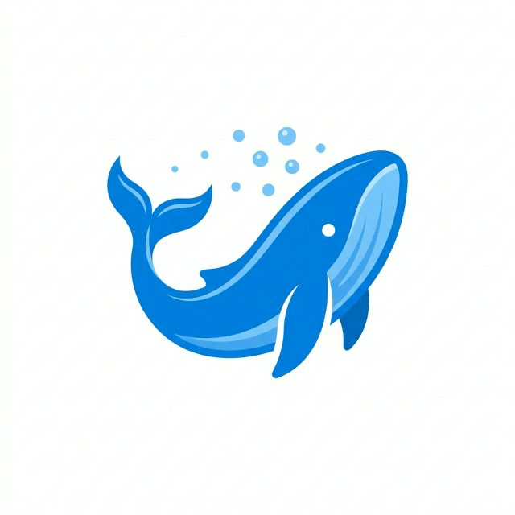

<p align="center">
  
</p>

<h1 align="center">BlankWhale</h1>

<p align="center">
  <strong>Open-source AI Training Studio</strong><br>
  Train, fine-tune, and deploy AI models on your own hardware. No cloud. No code required.
</p>

<p align="center">
  <a href="#download">Download</a> •
  <a href="#features">Features</a> •
  <a href="#getting-started">Getting Started</a> •
  <a href="#contributing">Contributing</a>
</p>

---

## Download

Download BlankWhale for your operating system. No terminal commands needed — just install and run.

| Platform | Download | Requirements |
|----------|----------|--------------|
| **macOS** (Apple Silicon & Intel) | [Download .dmg](https://github.com/blankwhale/blankwhale/releases/latest/download/BlankWhale_macos.dmg) | macOS 10.15+ |
| **Windows** (64-bit) | [Download .msi](https://github.com/blankwhale/blankwhale/releases/latest/download/BlankWhale_windows.msi) | Windows 10+ |
| **Linux** (64-bit) | [Download .AppImage](https://github.com/blankwhale/blankwhale/releases/latest/download/BlankWhale_linux.AppImage) | Ubuntu 20.04+ / Fedora 36+ |

> For GPU-accelerated training, install [CUDA](https://developer.nvidia.com/cuda-downloads) (NVIDIA) or use Apple Silicon (Metal support built-in).

---

## Features

### Visual Training Studio
- Drag-and-drop dataset upload (PDF, DOCX, CSV, JSON, TXT, images, audio, URLs)
- Visual training configuration — no YAML editing required
- Real-time training metrics with live loss charts
- Neural network visualization showing your model growing

### Built-in Code Editor
- Full Monaco Editor (VS Code engine) for writing custom training configs
- Python, YAML, JSON syntax highlighting
- Template files for LoRA configs, custom loss functions, data pipelines

### Local-First Training
- Train on **your own GPU** — NVIDIA CUDA, Apple Metal, AMD ROCm
- Fine-tune any HuggingFace model (Llama, Mistral, Phi, Gemma, Qwen, etc.)
- LoRA / QLoRA for efficient training on consumer hardware
- 4-bit and 8-bit quantization support

### Model Export
- Export to safetensors, GGUF (for Ollama/llama.cpp), ONNX
- Merge LoRA adapters back into the base model
- One-click deployment with REST API and embed widget

### Evaluate & Chat
- Chat with your trained model directly in the app
- BLEU, ROUGE-L, Perplexity, F1 benchmarks
- Compare before/after training performance

---

## Architecture

```
blankwhale/
├── src/                    # React + TypeScript frontend
│   ├── workspace/          # All workspace panels and canvases
│   └── components/         # Reusable UI components
├── src-tauri/              # Tauri desktop shell (Rust)
│   └── src/lib.rs          # GPU detection, file access, shell commands
├── engine/                 # Python training engine
│   ├── trainer.py          # Training orchestration (HuggingFace Trainer)
│   ├── model_loader.py     # Model loading with LoRA/QLoRA
│   ├── data_pipeline.py    # Data loading and preprocessing
│   ├── gpu_detect.py       # GPU detection (CUDA/Metal/ROCm)
│   ├── server.py           # WebSocket server for real-time metrics
│   └── export.py           # Export to safetensors/GGUF/ONNX
└── .github/workflows/      # CI/CD for automated builds
```

---

## Getting Started

### For Users
Just [download the app](#download) for your platform. No setup needed.

### For Developers

```bash
# Clone
git clone https://github.com/blankwhale/blankwhale.git
cd blankwhale

# Frontend
npm install

# Python engine
pip install -r engine/requirements.txt

# Run (web)
npm run dev

# Run (desktop)
npx tauri dev

# Build installer
npx tauri build
```

---

## GPU Support

| GPU | Framework | Status |
|-----|-----------|--------|
| NVIDIA (RTX 3060+) | CUDA | Fully supported |
| Apple Silicon (M1/M2/M3/M4) | Metal (MPS) | Fully supported |
| AMD | ROCm | Experimental |
| CPU only | — | Supported (slower) |

---

## Contributing

We welcome contributions! See [CONTRIBUTING.md](CONTRIBUTING.md) for details.

## License

MIT License — see [LICENSE](LICENSE) for details.

---

<p align="center">
  Built with Tauri, React, PyTorch, and HuggingFace Transformers.
</p>
